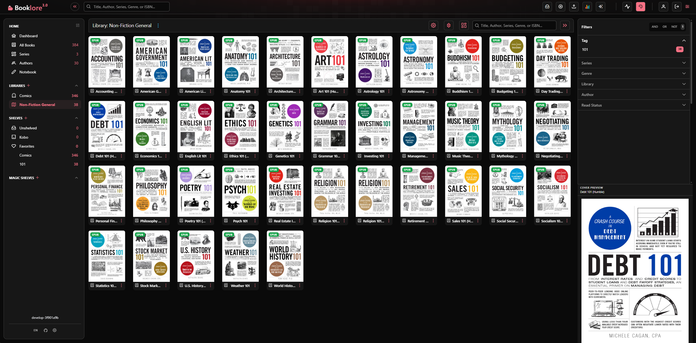
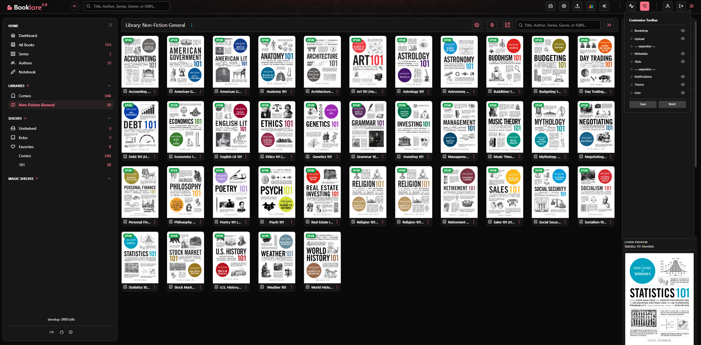
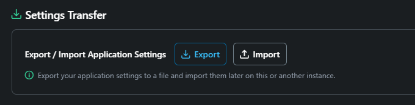

<p align="center">
  <a href="https://github.com/opensourcefan/Fable/tags"></a>
  <a href="https://github.com/opensourcefan/Fable/actions/workflows/develop-pipeline.yml?query=branch%3Adevelop"></a>
  <a href="https://github.com/opensourcefan/Fable/blob/develop/LICENSE"></a>
  <a href="https://github.com/opensourcefan/Fable/stargazers"></a>
  <a href="https://github.com/opensourcefan/Fable/issues"></a>
</p>


# Fable

A personal fork of [Booklore] with extended features, UI customizations, and an optional AI-powered comic panel detection service.

> **Advisory:** This is a personal project, shared as-is. It is 100% vibe-coded. I am not a developer.
> I may or may not update it. I may or may not read the Issues. I will not delete it if I get upset, I'm always upset.
> Please fork freely and do whatever you like with it. I am not taking requests.

---

## Contents

- [Under the Hood](#under-the-hood)
- [Main Features](#main-features)
- [Installation](#installation)
  - [Requirements](#requirements)
  - [Fresh Install](#fresh-install)
  - [Update Existing Install](#update-existing-install)
  - [Install Without AI](#install-without-ai)
- [Sample `.env`](#sample-env)
- [Sample `docker-compose.yml`](#sample-docker-composeyml)
- [Saving Your Data](#saving-your-data)
  - [Application Settings](#application-settings)
  - [Book Files and Covers](#book-files-and-covers)
- [AI Panel Detection — Quick Start](#ai-panel-detection--quick-start)
- [Familiarization Guide](#familiarization-guide)
- [Screenshots](#screenshots)

---

## Under the Hood

This fork includes a number of targeted fixes to improve reliability, memory efficiency, and UI responsiveness — particularly for larger libraries. No upstream features were removed.

- **~50% less peak memory per image operation** — reduced pixel decode ceiling and replaced a lazy image scaler that held source buffers in memory with a direct bicubic draw that flushes source memory immediately
- **Native image buffers always released** — flush calls are now guaranteed via `finally` blocks across all thumbnail generation paths, preventing silent leaks during error conditions
- **No more zombie subprocesses** — KEPUB conversion and CBR metadata extraction processes are now properly terminated in `finally` blocks; failed or timed-out operations can no longer accumulate as orphaned OS processes
- **Komga series endpoints no longer fall back to catalog-wide scans** — series pages, series detail, and series book lists now resolve the requested series name first and fetch only the matching books; the all-libraries series view no longer builds an in-memory map from a full eager-loaded catalog scan
- **Summary list responses avoid heavy metadata loads** — list and paged summary fetches now use a lighter summary graph, while long descriptions stay lazy until a detail flow actually requests them
- **Browser views now start paged-first** — opening All Books, a library, a shelf, or Not Shelfed no longer has to bootstrap the full catalog just to render the first screen; sidebar counts and topbar search now use lightweight paged queries as well
- **Covers load once, not on every navigation** — browser-cache headers added to all image endpoints (7-day TTL for book covers, 1-hour for author images); the existing cache-busting URL timestamps ensure stale images are never served
- **Sidebar navigation no longer rebuilds the book grid** — the Angular route reuse strategy now correctly stores and reattaches the "All Books" and "Not Shelfed" views, preventing unnecessary cover reloads when switching sidebar sections
- **HTTP download safety** — downloaded image payloads are now rejected if they exceed 5 MB before being handed to the image decoder; network connections for image fetching are bounded by connect (10 s) and read (30 s) timeouts, preventing runaway thread holds on slow or unresponsive sources

---

## Main Features

- **Comic Panel Detection AI** — Detects and saves panel flow data for CBZ/CBR comics using a bundled YOLO-based AI model. Enables panel-by-panel navigation in the reader.
- **AI Semantic Search** — Search your book collection using natural language queries. Uses a local HuggingFace embedding model to find books based on their actual content.
- **ComicVine URL Issue Navigation** — In metadata search, paste a ComicVine volume or issue URL and optionally provide an issue number or inclusive range (for example `46` or `43-171`) to resolve exact ComicVine issue matches.
- **ComicVine Batch Issue Sequencing** — In custom metadata fetch for multi-book selections, you can use the same ComicVine source URL plus issue number/range inputs and Fable will assign sequential issues across the selected books while keeping review-mode workflows.
- **Directory Explorer** — Browse books by actual library folders from a collapsible folder panel in All Books and library views, then use the reset button beside the folder toggle to clear the active folder scope while keeping the larger book view available.
- **Currently Reading Dashboard Panel** — Add an optional Currently Reading scroller from Dashboard Settings and populate it from a book's More Actions menu to keep a hand-picked reading shortlist on the home screen.
- **Custom Theme Colors** — Use preset palettes or set custom primary and surface colors with a color picker or pasted hex value; theme preferences are saved per user.
- **Adjustable Cover Preview Panel** — Toggle the right-side cover preview on or off in Settings.
- **Customizable Upper Toolbar** — Add, remove, and reorder toolbar buttons; insert separators. Drag-and-drop support.
- **Adjustable Side Panels** — Resizable left and right sidebars.
- **Drag-and-Drop Sidebar Sorting** — Turn on Re-order mode to drag left sidebar headings and rows on desktop or mobile without affecting normal sidebar navigation.
- **Settings Backup & Restore** — Export and import your full application settings.
- **User-Defined Media Types** — Create custom media types (Magazines, Catalogs, Textbooks, etc.) and filter by them.
- **Title Row Controls** — Fine-grained tweaks for book card title display.
- **Sidebar Repositioned Controls** — Settings and Language Selection moved to the bottom of the left sidebar.
- **Telemetry Removed** — All upstream telemetry, support icons, and removed documentation links have been stripped out.
- **OIDC / Forward Auth Support** — OpenID Connect login and proxy forward-auth support included.
- **Language Selection** — Multi-language support with in-app language switcher.

---

## Installation

### Requirements

- Docker and Docker Compose
- MariaDB (included in the provided Compose file)

### Fresh Install

```bash
# 1. Download the Compose file
curl -O https://raw.githubusercontent.com/opensourcefan/Fable/develop/docker-compose.yml

# 2. Create your .env file (see Sample .env below)

# 3. Pull and start
docker compose pull
docker compose up -d

# 4. If AI is enabled, pull and start the AI container separately
docker compose pull app-ai-panel
docker compose up -d app-ai-panel
```

### Update Existing Install

```bash
curl -O https://raw.githubusercontent.com/opensourcefan/Fable/develop/docker-compose.yml
docker compose pull
docker compose up -d

# If AI is enabled:
docker compose pull app-ai-panel
docker compose up -d app-ai-panel
```

### Optional RAR Binary For CBR Metadata Writes

If you want Fable to preserve `.cbr` files during metadata writes instead of falling back to a slower `.cbz` conversion, place a compatible Linux `rar` binary at `./docker/rar/rar` before starting the container.

- The repository `docker-compose.yml` now mounts `./docker/rar` into the container at `/opt/fable-rar`.
- The container entrypoint automatically exports `FABLE_RAR_BIN=/opt/fable-rar/rar` when that file exists and is executable.
- If no `rar` binary is provided, Fable keeps its current fallback behavior and may convert `.cbr` to `.cbz` when writing embedded metadata.

### Install Without AI

Omit `COMPOSE_PROFILES=ai` from your `.env`. No AI image will be pulled and no model files will be downloaded. AI features can be left disabled in **Settings > AI Panel Detection**.

---

## Sample `.env`

```ini
# User / Group IDs for file ownership
APP_USER_ID=1000
APP_GROUP_ID=1000

# Timezone
TZ=America/Vancouver

# Database connection
DATABASE_URL=jdbc:mariadb://mariadb:3306/fable
DB_USER=fable
DB_PASSWORD=ChangeMe@$@P

# MariaDB container
DB_USER_ID=1000
DB_GROUP_ID=1000
MYSQL_ROOT_PASSWORD=ChangeMe@$@P
MYSQL_DATABASE=fable
REMOTE_USER_PASSWORD=ChangeMe@$@P

# Storage type: LOCAL (default) or NETWORK (all data written to MariaDB only)
#DISK_TYPE=NETWORK

##################################################################
#                                                                #
#    ###  ###     #### ##### ##### ##### ### #   #  ###   ####   #
#   #   #  #     #     #       #     #    #  ##  # #     #       #
#   #####  #      ###  ####    #     #    #  # # # #  ##  ###    #
#   #   #  #         # #       #     #    #  #  ## #   #     #   #
#   #   # ###    ####  #####   #     #   ### #   #  ###  ####    #
#                                                                # 
##################################################################

# AI Features: Panel Detection & Semantic Search
# Optional — uncomment (delete # from the front) the 5 lines marked with (# <<) to enable all AI features.

### 1. Tell docker-compose to start the AI containers
# COMPOSE_PROFILES=ai  # <<

### 2. Tell the main Fable app where to talk to the AI containers internally
# AI_SERVICE_BASE_URL=http://app-ai-panel:8080  # <<
# AI_SEARCH_SERVICE_BASE_URL=http://fable-ai-search:8080  # <<

### 3. Expose the AI services to your host machine (for debugging or direct access)
# AI_PANEL_PORT=18080  # <<
# AI_SEARCH_PORT=18081  # <<

#### ---- AI Settings ----
#### AI models are now configured directly inside the Fable UI!
#### Go to Settings -> AI / AI Search to set your models,
#### API keys, and external endpoints (Zero-Config Architecture).
```

---

## Sample `docker-compose.yml`

```yaml
services:
  fable:
    image: ghcr.io/opensourcefan/fable:stable
    container_name: fable
    restart: unless-stopped
    depends_on:
      mariadb:
        condition: service_healthy
    environment:
      - USER_ID=${APP_USER_ID}
      - GROUP_ID=${APP_GROUP_ID}
      - TZ=${TZ}
      - DATABASE_URL=${DATABASE_URL}
      - DATABASE_USERNAME=${DB_USER}
      - DATABASE_PASSWORD=${DB_PASSWORD}
      - DISK_TYPE=${DISK_TYPE}
      - AI_SERVICE_BASE_URL=${AI_SERVICE_BASE_URL:-http://app-ai-panel:8080}
      - AI_SEARCH_SERVICE_BASE_URL=${AI_SEARCH_SERVICE_BASE_URL:-http://fable-ai-search:8080}
    ports:
      - "6060:6060"
    volumes:
      - ./data:/app/data
      - ./books:/books
      - ./bookdrop:/bookdrop
      - ./docker/rar:/opt/booklore-rar:ro  # Optional: mount a compatible Linux rar binary at ./docker/rar/rar for in-place CBR metadata writes
    networks:
      - fable_shared

  mariadb:
    image: lscr.io/linuxserver/mariadb:11.4.11
    container_name: mariadb
    restart: unless-stopped
    environment:
      - PUID=${DB_USER_ID}
      - PGID=${DB_GROUP_ID}
      - TZ=${TZ}
      - MYSQL_ROOT_PASSWORD=${MYSQL_ROOT_PASSWORD}
      - MYSQL_DATABASE=${MYSQL_DATABASE}
      - MYSQL_USER=${DB_USER}
      - MYSQL_PASSWORD=${DB_PASSWORD}
      - REMOTE_USER_PASSWORD=${REMOTE_USER_PASSWORD}
    volumes:
      - ./mariadb/config:/config
      - ./mariadb/conf.d:/config/mariadb/conf.d
    ports:
      - "3306:3306"
    networks:
      - fable_shared
    healthcheck:
      test: ["CMD", "mariadb-admin", "ping", "-h", "localhost"]
      interval: 5s
      timeout: 5s
      retries: 10

  app-ai-panel:
    image: ${AI_PANEL_IMAGE:-ghcr.io/opensourcefan/fable-panel-ai:stable}
    container_name: app-ai-panel
    profiles: ["ai"]
    restart: unless-stopped
    environment:
      - TZ=${TZ}
      - HF_HOME=/models
    volumes:
      - ./data/ai-models:/models
    ports:
      - "${AI_PANEL_PORT:-18080}:8080"
    networks:
      - fable_shared
    healthcheck:
      test: ["CMD", "python", "-c", "import urllib.request; urllib.request.urlopen('http://localhost:8080/health', timeout=3)"]
      interval: 30s
      timeout: 5s
      retries: 5

  fable-ai-search:
    image: ${AI_SEARCH_IMAGE:-ghcr.io/opensourcefan/fable-search-ai:stable}
    container_name: fable-ai-search
    profiles: ["ai"]
    restart: unless-stopped
    environment:
      - TZ=${TZ}
      - DB_HOST=mariadb
      - DB_PORT=3306
      - DB_NAME=${MYSQL_DATABASE}
      - DB_USER=${DB_USER}
      - DB_PASSWORD=${DB_PASSWORD}
    volumes:
      - ./data/ai-search-models:/models
    ports:
      - "${AI_SEARCH_PORT:-18081}:8080"
    depends_on:
      mariadb:
        condition: service_healthy
    networks:
      - fable_shared
    healthcheck:
      test: ["CMD", "python", "-c", "import urllib.request; urllib.request.urlopen('http://localhost:8080/health', timeout=3)"]
      interval: 30s
      timeout: 5s
      retries: 5

networks:
  fable_shared:
    name: fable_shared
```

> **Note:** This is a representative sample. Always use the `docker-compose.yml` pulled from the repository for the most up-to-date configuration.

### Adding AI Search to an Existing Installation

If you already have Fable running and want to add AI Semantic Search, follow these steps. Your existing database, books, and settings are preserved — the AI search service connects to the same MariaDB instance and stores embeddings in a separate table.

#### Step 1: Update your `docker-compose.yml`

Copy the lines below into your existing `docker-compose.yml` file. Paste them under the `services:` section, right after the `app-ai-panel` entry (or after `mariadb` if you don't use panel detection):

```yaml
  fable-ai-search:
    image: ${AI_SEARCH_IMAGE:-ghcr.io/opensourcefan/fable-search-ai:stable}
    container_name: fable-ai-search
    profiles: ["ai"]
    restart: unless-stopped
    environment:
      - TZ=${TZ}
      - DB_HOST=mariadb
      - DB_PORT=3306
      - DB_NAME=${MYSQL_DATABASE}
      - DB_USER=${DB_USER}
      - DB_PASSWORD=${DB_PASSWORD}
    volumes:
      - ./data/ai-search-models:/models
    ports:
      - "${AI_SEARCH_PORT:-18081}:8080"
    depends_on:
      mariadb:
        condition: service_healthy
    networks:
      - fable_shared
    healthcheck:
      test: ["CMD", "python", "-c", "import urllib.request; urllib.request.urlopen('http://localhost:8080/health', timeout=3)"]
      interval: 30s
      timeout: 5s
      retries: 5
```

#### Step 2: Update your `.env` file

Add these lines to your `.env`:

```ini
COMPOSE_PROFILES=ai
AI_SEARCH_SERVICE_BASE_URL=http://fable-ai-search:8080
AI_SEARCH_PORT=18081
```

#### Step 3: Pull and start the new service safely

**If your existing containers are running**, use this approach to avoid "container already exists" and "port already bound" errors:

```bash
# Pull the new AI search image
docker compose pull fable-ai-search

# Stop only the main Fable container (preserves MariaDB and your data)
docker compose stop fable

# Bring everything back up, including the new AI search service
docker compose --profile ai up -d

# Verify all containers are healthy
docker compose ps
```

**If you get a "port is already allocated" error**, check if anything else is using port 18081:

```bash
# Check what's using the AI search port
sudo ss -tlnp | grep 18081

# If the port is in use, change AI_SEARCH_PORT in your .env to an available port:
# AI_SEARCH_PORT=18082
```

**If you get a "container already exists" error**, remove the stale container reference:

```bash
# Remove the old container (data volumes are unaffected)
docker rm fable-ai-search 2>/dev/null || true

# Then start fresh
docker compose --profile ai up -d
```

#### Step 4: Enable AI Search in the UI

1. Open **Settings > AI**
2. Enable **AI Semantic Search**
3. Wait for the status to show **READY**
4. Embed your books: Click the three dots on any book card → **Embed for AI Search**

---

## Saving Your Data

Fable stores your data in two places. Back up both to ensure a complete recovery.

### Application Settings

Your admin configuration (libraries, users, shelves, metadata settings, etc.) lives in the MariaDB database.

**Export via the UI** — Go to **Settings → Global Preferences → Settings Transfer** and click **Export**. This downloads a `fable-settings-*.json` file you can re-import on the same or a new instance.

**Full database backup (recommended for complete protection)** — Exports everything including all book metadata, read progress, and shelf assignments:

```bash
# Load your .env variables, then run:
docker exec mariadb mariadb-dump \
  --single-transaction --quick --no-tablespaces \
  -u root -p"$MYSQL_ROOT_PASSWORD" \
  fable > "fable_backup_$(date +%Y%m%d_%H%M%S).sql"
```

> See [docs/mariadb-backup-restore.html](docs/mariadb-backup-restore.html) for the full backup, restore, and automation guide.

### Book Files and Covers

Your actual book files, cover images, and thumbnails are **not** stored in the database. Back them up separately:

| Directory | Contents |
|---|---|
| `./books/` | All book files |
| `./data/` | Cover images, thumbnails, author images, AI model |
| `./bookdrop/` | Bookdrop inbox (if in use) |

A simple full backup copies all three:

```bash
tar -czf fable-files-backup-$(date +%Y%m%d).tar.gz ./books ./data ./bookdrop
```

---

## AI Features — Quick Start

1. Add `COMPOSE_PROFILES=ai` to your `.env`
2. Pull and start all services (see [Installation](#installation) above)
3. Open **Settings > AI Tab**
4. Enable **AI Panel Detection** and/or **AI Semantic Search** and wait for status to show **READY**
   - The models are bundled inside the AI container images
   - On first start they are automatically seeded to the mounted models folders
   - No manual file placement is required
5. **For Panel Detection**: Open a comic in the reader and use the AI button to scan the current book. Optionally run a batch scan from settings.
6. **AI Search Features**:
   - **Global AI Search:** Click the sparkly blue **AI Search** icon in the topbar or library search fields to search your entire collection by concepts and themes.
   - **Book-Specific AI Search:** Click the glowing **AIS** badge on any book card to ask questions specifically about that book.
   - **Note:** Make sure you have embedded your books first (Click the three dots on any book card -> **Embed for AI Search**).
   - **Zero Configuration Needed:** Fable comes with everything you need built-in! The AI search engine (powered by Ollama) runs automatically inside its own secure container. You don't need to install any external software or configure network settings to get started. Just pick a preset in your `.env` file and enjoy.

### AI Notes

- **Advanced Configuration**: See [AI-Search-Configuration.md](docs/AI-Search-Configuration.md) for how to tune semantic search, change models, or use external providers (like Ollama).
- The AI compose profile is opt-in. Omitting `COMPOSE_PROFILES=ai` skips the AI images entirely.
- The AI containers use CPU-only inference to keep the image size manageable.
- You can override the AI Search model by uncommenting # AI_Search_EMBEDDING or LLM in your `.env`.
- If the models fail to load, use the **Reload** buttons in Settings.
- If running Fable outside Docker, set `AI_SERVICE_BASE_URL` and `AI_SEARCH_SERVICE_BASE_URL` to the host-mapped endpoints.

---

## Familiarization Guide

New to Fable? A complete **Familiarization Guide** is available in the `docs/` folder:

- **[Fable-Familiarization-Guide.pdf](docs/Fable-Familiarization-Guide.pdf)** — Printable PDF version
- **[Fable-Familiarization-Guide.html](docs/Fable-Familiarization-Guide.html)** — Browser-viewable HTML version

The guide is written for users of all experience levels and covers every feature — libraries, importing, reading, shelves, metadata, search, AI panel detection, OPDS, user management, settings, backups, and more. Each section includes what you can do, what you can't do, and things to be careful about.

The app's footer PDF button links to this same guide file directly. If you want the guide to behave like a normal imported PDF in the built-in reader, copy the PDF into a library or into BookDrop and import it like any other asset.

Maintenance rule: the HTML guide is the source of truth. When the guide changes, regenerate the PDF from that HTML and update this README section in the same change so the repository docs stay in sync.

---

## Screenshots







## Automated Maintenance
Dependabot is configured to watch the Gradle backend, the UI npm manifest, the AI panel's pip requirements, the Dockerfiles, the Docker Compose files, and GitHub Actions workflows. Patch and minor Dependabot pull requests are labeled for unattended merge only after the develop CI workflow succeeds, so routine maintenance does not depend on manual PR handling or branch protection. Repository-side GitHub vulnerability alerts and automated security fixes should remain enabled. The Gradle automation intentionally ignores `com.github.RouHim:jaudiotagger` because that JitPack-hosted dependency currently triggers Dependabot source-authentication failures; it should be reviewed manually until it is replaced with a Dependabot-compatible source. The AI panel's `pillow` dependency now tracks secure 12.x releases directly, so future patch and minor updates can flow through the normal unattended Dependabot path. Workflow-file dependency updates are still surfaced automatically, but GitHub's default Actions token does not auto-merge them, so those updates remain the one part of the maintenance flow that still needs a workflow-capable automation token or GitHub App if you want them merged unattended as well.
